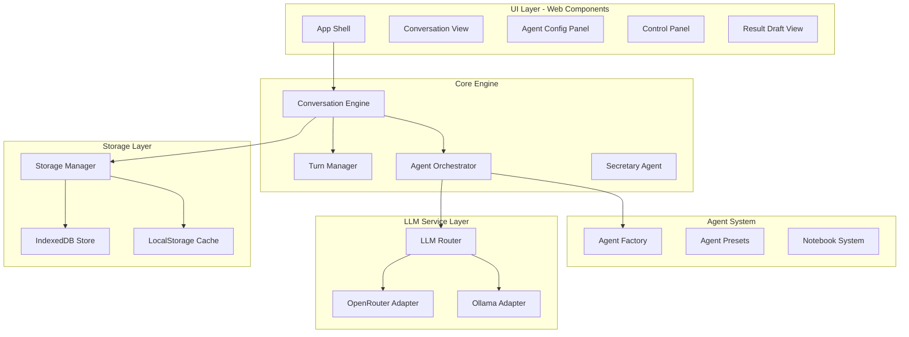
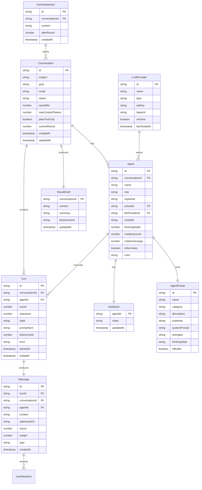

# AI Agent Brainstorming Playground

## Key Technical Decisions

| Decision | Choice | Rationale ||----------|--------|-----------|| API Key Storage | Persistent in IndexedDB | Keys stored globally, reusable across all sessions. Warning displayed about browser security limitations. || Third-party Libraries | Allowed (reliable, small) | Dexie.js for IndexedDB, uuid for IDs, gpt-tokenizer for token counting || Turn Idempotency | Deterministic turnId | Prevents duplicate executions on resume/retry || Streaming Control | AbortController per turn | Enables reliable Stop/Pause mid-stream || Ollama CORS | Connectivity test + setup guide | Browser-to-local Ollama requires CORS config |

## Architecture Overview




## Data Model




### Turn States

- `planned` - Scheduled but not started
- `running` - LLM request in progress (AbortController active)
- `completed` - Successfully finished
- `failed` - Error occurred (stored in `error` field)
- `cancelled` - User stopped mid-execution

### Message Types

- `response` - Normal agent response
- `summary` - Secretary summary
- `interjection` - User input
- `system` - System notifications

## Implementation Phases

### Phase 1: Project Foundation (Files: 8-10)

Set up the project structure, build system, and core storage layer.**Key Files:**

- `index.html` - Single HTML entry point
- `src/main.ts` - Application bootstrap
- `src/storage/db.ts` - IndexedDB wrapper with schema
- `src/storage/storage-manager.ts` - Unified storage API
- `src/types/index.ts` - TypeScript interfaces for all data models
- `src/utils/event-bus.ts` - Pub/sub for component communication
- `vite.config.ts` - Build configuration (Vite for fast dev)

**Deliverables:**

- Working IndexedDB with all tables
- LocalStorage for settings/API keys
- Type-safe data access layer
- Hot-reload development environment

---

### Phase 2: LLM Service Layer (Files: 6-7)

Create the abstraction layer for LLM providers.**Key Files:**

- `src/llm/llm-router.ts` - Provider routing and request handling
- `src/llm/providers/base-provider.ts` - Abstract provider interface
- `src/llm/providers/openrouter.ts` - OpenRouter API adapter
- `src/llm/providers/ollama.ts` - Ollama local API adapter
- `src/llm/prompt-builder.ts` - Context assembly and prompt formatting
- `src/llm/token-counter.ts` - Token estimation using gpt-tokenizer
- `src/llm/types.ts` - LLM-specific types

**Features:**

- Streaming response support with AbortController
- Token counting for context window management
- Error handling with exponential backoff retries
- **Persistent API key storage** in IndexedDB (global, reusable across sessions)
- Provider connectivity test (especially critical for Ollama CORS)
- Model list fetching from providers

**Ollama CORS Handling:**

- Auto-detect CORS errors with friendly setup instructions
- Guide user to set `OLLAMA_ORIGINS=*` environment variable
- Connectivity test button in settings

---

### Phase 3: Agent System (Files: 6-7)

Build the agent creation, configuration, and preset system.**Key Files:**

- `src/agents/agent.ts` - Agent class with state management
- `src/agents/agent-factory.ts` - Agent instantiation
- `src/agents/notebook.ts` - Agent notebook implementation
- `src/agents/presets/index.ts` - Built-in preset definitions
- `src/agents/presets/software-presets.ts` - Software dev expert presets
- `src/agents/secretary.ts` - Secretary agent with summarization

**Built-in Presets (15+):**

- Software Architect, Senior Frontend Dev, Senior Backend Dev
- Database Expert, DevOps Engineer, Security Expert
- UX Designer, Product Manager, QA Engineer
- Data Scientist, ML Engineer, Technical Writer
- Project Manager, Business Analyst, CTO

---

### Phase 4: Conversation Engine (Files: 8-9)

Core orchestration logic for managing discussions.**Key Files:**

- `src/engine/conversation-engine.ts` - Main orchestrator with state machine
- `src/engine/turn-manager.ts` - Turn-taking logic (all modes)
- `src/engine/turn-executor.ts` - Execute single turn with AbortController
- `src/engine/context-builder.ts` - Build conversation context for agents
- `src/engine/context-strategy.ts` - Context window management strategies
- `src/engine/result-manager.ts` - Result draft compilation
- `src/engine/user-interjection.ts` - Handle user inputs
- `src/engine/state-machine.ts` - Conversation state transitions

**Turn Modes:**

1. **Round-robin**: Fixed order, configurable rounds
2. **Moderator**: AI moderator selects next speaker based on topic relevance
3. **Dynamic**: Agents can address others using `@AgentName`, addressed agent responds

**Turn Idempotency (Prevents Double Execution):**

- Each turn gets deterministic `turnId = hash(conversationId + round + sequence)`
- Before execution: check if turnId already completed in DB
- On resume: skip completed turns, retry failed ones
- Message deduplication via turnId foreign key

**Context Window Strategy:**

- Calculate available tokens: `maxContextTokens - systemPrompt - reserveForResponse`
- Priority order: (1) User interjections, (2) Recent messages, (3) Notebook excerpts, (4) Older messages (summarized)
- Auto-summarize older rounds when context fills up
- Per-agent notebook injection based on `notebookUsage` setting

**Controls:**

- Start/Stop/Pause/Resume/Reset
- Speed control (configurable delay between turns: 0-10s)
- Force next speaker (skip queue)
- Inject user thought (immediate or queued for next round)

---

### Phase 5: UI Components (Files: 12-15)

Web Components for the entire interface.**Component Hierarchy:**

```javascript
<app-shell>
  <nav-sidebar>
    <conversation-list>
    <settings-panel>
  </nav-sidebar>
  <main-content>
    <conversation-header>
    <agent-roster>
    <message-stream>
    <result-draft-panel>
    <control-bar>
    <user-input>
  </main-content>
</app-shell>
```

**Key Components:**

- `src/components/app-shell.ts` - Main layout container
- `src/components/conversation-list.ts` - Sidebar conversation list
- `src/components/message-stream.ts` - Chat-like message display
- `src/components/agent-card.ts` - Agent avatar and status
- `src/components/control-bar.ts` - Playback controls
- `src/components/result-draft.ts` - Live result compilation
- `src/components/new-conversation-modal.ts` - Conversation setup wizard

**Design System:**

- CSS custom properties for theming
- Dark mode by default with light option
- Glassmorphism cards for agents
- Smooth animations for message flow
- Color-coded agents for easy tracking

---

### Phase 6: Advanced Features (Files: 5-6)

Polish and advanced functionality.**Features:**

- User reaction system (like/weight messages)
- Export conversations (JSON, Markdown)
- Import/export agent presets
- Keyboard shortcuts
- Conversation templates
- Search across conversations

---

## Tech Stack Summary

| Layer | Technology ||-------|------------|| Language | TypeScript 5.x (strict mode) || UI | Vanilla Web Components || Build | Vite || Storage | IndexedDB (Dexie.js) + LocalStorage || Styling | CSS Custom Properties || LLM | OpenRouter API + Ollama REST API |**Dependencies (minimal, reliable):**

- `dexie` (~40KB) - IndexedDB wrapper with excellent TypeScript support
- `uuid` (~2KB) - RFC4122 UUID generation
- `gpt-tokenizer` (~15KB) - Accurate token counting for context management
- `vite` (dev only) - Fast build tool

## File Structure

```javascript
ai-brain-storming-1/
├── index.html
├── package.json
├── tsconfig.json
├── vite.config.ts
├── src/
│   ├── main.ts
│   ├── types/
│   │   └── index.ts
│   ├── storage/
│   │   ├── db.ts
│   │   └── storage-manager.ts
│   ├── llm/
│   │   ├── llm-router.ts
│   │   ├── prompt-builder.ts
│   │   ├── token-counter.ts
│   │   ├── types.ts
│   │   └── providers/
│   │       ├── base-provider.ts
│   │       ├── openrouter.ts
│   │       └── ollama.ts
│   ├── agents/
│   │   ├── agent.ts
│   │   ├── agent-factory.ts
│   │   ├── notebook.ts
│   │   ├── secretary.ts
│   │   └── presets/
│   │       ├── index.ts
│   │       └── software-presets.ts
│   ├── engine/
│   │   ├── conversation-engine.ts
│   │   ├── turn-manager.ts
│   │   ├── turn-executor.ts
│   │   ├── context-builder.ts
│   │   ├── context-strategy.ts
│   │   ├── result-manager.ts
│   │   ├── user-interjection.ts
│   │   └── state-machine.ts
│   ├── components/
│   │   ├── app-shell.ts
│   │   ├── nav-sidebar.ts
│   │   ├── conversation-list.ts
│   │   ├── conversation-header.ts
│   │   ├── agent-roster.ts
│   │   ├── agent-card.ts
│   │   ├── message-stream.ts
│   │   ├── message-bubble.ts
│   │   ├── control-bar.ts
│   │   ├── result-draft.ts
│   │   ├── user-input.ts
│   │   ├── settings-panel.ts
│   │   ├── provider-setup.ts
│   │   └── new-conversation-modal.ts
│   ├── utils/
│   │   ├── event-bus.ts
│   │   └── helpers.ts
│   └── styles/
│       ├── global.css
│       ├── variables.css
│       └── animations.css
└── public/
    └── icons/
```


## UI Design Concept

**Theme:** "Neural Nexus" - Dark futuristic with neon accents

- **Background**: Deep space gradient (#0a0a0f to #1a1a2e)
- **Primary accent**: Electric cyan (#00f5ff)
- **Secondary accent**: Vivid purple (#8b5cf6)
- **Agent colors**: Each agent gets a unique hue from a harmonious palette
- **Cards**: Frosted glass effect with subtle borders
- **Typography**: JetBrains Mono for code/technical, Space Grotesk for UI
- **Animations**: Subtle pulse on active agent, smooth message slide-in

**Key UX Elements:**

- Agent avatars with status indicators (thinking, speaking, idle)
- Real-time typing indicator during LLM streaming
- Collapsible result draft that auto-updates
- Quick-action buttons on messages (like, pin, copy)
- Conversation progress indicator showing rounds completed
- Per-agent constraint chips (e.g., "Plain Text", "Max 200 tokens")
- Timeline view showing Rounds -> Turns -> Messages
- Provider status indicator (connected/disconnected)
- Keyboard shortcuts overlay (press `?` to show)

---

## Risk Mitigation

| Risk | Mitigation ||------|------------|| Ollama CORS blocked | Connectivity test + clear setup instructions in UI || Context overflow | Token counting + auto-summarization of old rounds || Double turn execution | Deterministic turnId + DB check before execution || Lost state on crash | All turns persisted; resume from last completed turn || API key exposure | Warning in UI; keys stored locally only, never transmitted except to provider |