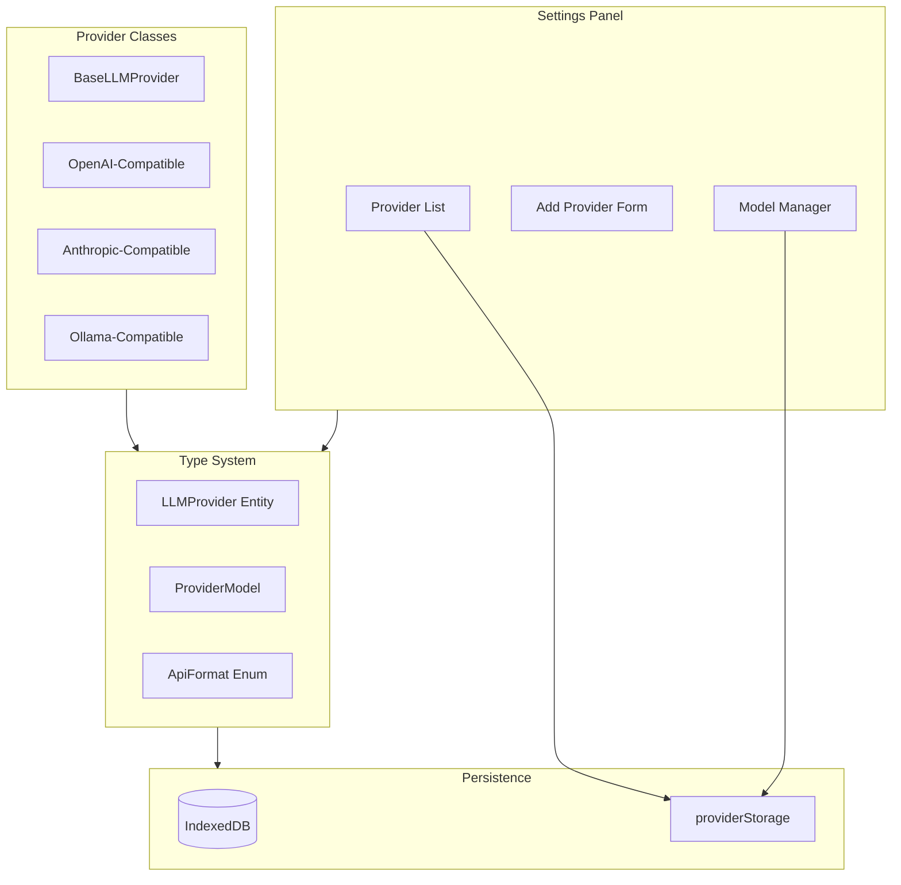

# LLM Provider Configuration Redesign

## Overview

Transform the LLM provider system from a fixed two-provider setup to a flexible, user-configurable system supporting multiple API formats and user-defined models.

## Architecture




## Data Model Changes

### 1. Update `LLMProvider` interface in [`src/types/index.ts`](src/types/index.ts)

```typescript
export type ApiFormat = 'openai' | 'anthropic' | 'ollama';

export interface ProviderModel {
  id: string;           // e.g., "gpt-4o" or "claude-3-sonnet"
  name: string;         // Display name
  contextLength: number;
  isCustom: boolean;    // User-defined vs auto-fetched
}

export interface LLMProvider {
  id: string;
  name: string;
  apiFormat: ApiFormat;
  apiKey?: string;
  baseUrl: string;
  isActive: boolean;
  lastTestedAt?: number;
  autoFetchModels: boolean;  // Whether to fetch models from API
  models: ProviderModel[];   // User-defined + auto-fetched models
}
```


### 2. Update Database Schema in [`src/storage/db.ts`](src/storage/db.ts)

- Increment database version to 2
- Add migration to convert existing providers to new format
- `models` field stored as JSON array

## Provider Implementation Changes

### 3. Refactor [`src/llm/providers/base-provider.ts`](src/llm/providers/base-provider.ts)

- Add `apiFormat` property
- Add abstract `fetchModels()` method for auto-fetch
- Make `getModels()` return combined user-defined + auto-fetched models

### 4. Create Generic Provider Classes

Replace type-specific providers with format-based providers:

- `openai-provider.ts` - Handles OpenAI-compatible APIs (OpenRouter, vLLM, LM Studio, etc.)
- `anthropic-provider.ts` - Handles Anthropic API format
- Keep `ollama-provider.ts` - Ollama-specific format

### 5. Update [`src/llm/llm-router.ts`](src/llm/llm-router.ts)

- Route based on `apiFormat` instead of hardcoded `type`
- Remove the switch statement limitation
- Use factory pattern for provider instantiation

## UI Changes

### 6. Update [`src/components/settings-panel.ts`](src/components/settings-panel.ts)

Add three new sections:

- **Add Provider Button**: Creates new provider with name, format, base URL, API key
- **Model Manager**: For each provider, show models list with add/remove capability
- **Auto-fetch Toggle**: Per-provider toggle for automatic model discovery
```javascript
+------------------------------------------+
| LLM Providers                            |
+------------------------------------------+
| [+ Add Provider]                         |
|                                          |
| OpenRouter (OpenAI Format)        [Edit] |
| ├─ API Key: ****                         |
| ├─ Base URL: https://openrouter.ai/...   |
| ├─ Auto-fetch models: [ON]               |
| └─ Models: claude-3.5-sonnet, gpt-4o ... |
|    [+ Add Model]                         |
|                                          |
| My vLLM Server (OpenAI Format)    [Edit] |
| ├─ API Key: (none)                       |
| ├─ Base URL: http://localhost:8000       |
| ├─ Auto-fetch models: [OFF]              |
| └─ Models: llama-3.1-70b                 |
|    [+ Add Model]                         |
+------------------------------------------+
```


## Migration Strategy

The database migration will:

1. Convert existing `type: 'openrouter'` to `apiFormat: 'openai'`
2. Convert existing `type: 'ollama'` to `apiFormat: 'ollama'`
3. Set `autoFetchModels: true` for OpenRouter, `true` for Ollama
4. Initialize `models: []` (will populate on first fetch)

## Files to Modify

| File | Changes ||------|---------|| [`src/types/index.ts`](src/types/index.ts) | Add `ApiFormat`, `ProviderModel`, update `LLMProvider` || [`src/storage/db.ts`](src/storage/db.ts) | Version 2 schema, migration logic || [`src/storage/storage-manager.ts`](src/storage/storage-manager.ts) | Add model CRUD operations || [`src/llm/types.ts`](src/llm/types.ts) | Update LLM-specific types || [`src/llm/providers/base-provider.ts`](src/llm/providers/base-provider.ts) | Add apiFormat, fetchModels || [`src/llm/providers/openai-provider.ts`](src/llm/providers/openai-provider.ts) | New file (replaces openrouter.ts) || [`src/llm/providers/anthropic-provider.ts`](src/llm/providers/anthropic-provider.ts) | New file || [`src/llm/providers/ollama.ts`](src/llm/providers/ollama.ts) | Update to new interface |